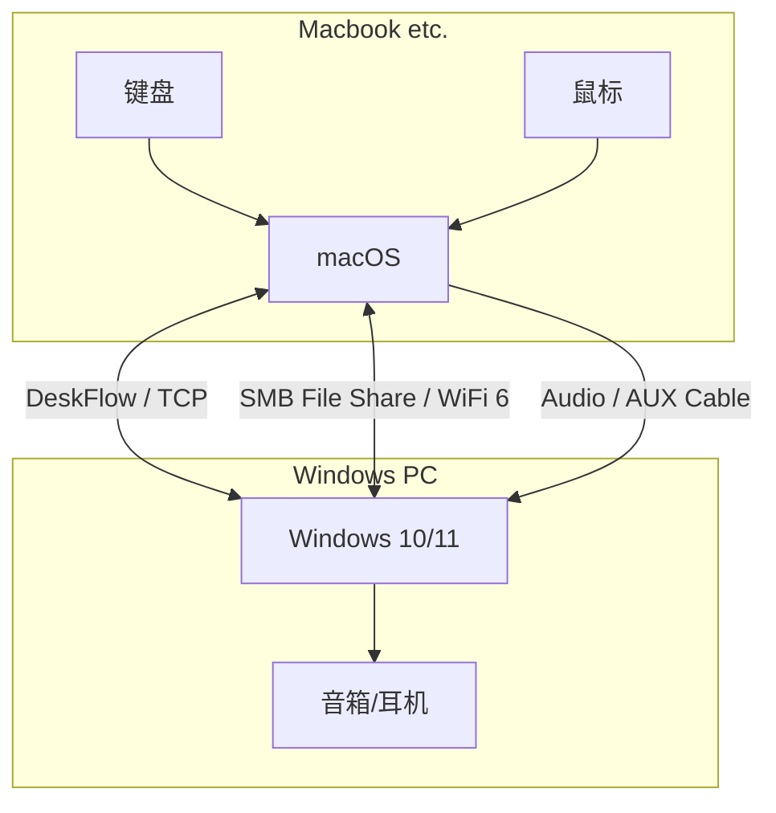

  简体中文 | <a href="./README_en.md">English</a>

# 🌉 Win-Mac DeskBridge 局域网极致互联方案

  

> **拒绝来回插拔。基于开源工具链，构建 Windows 与 macOS 的极致无缝协作流。**

## 📖 简介 (Introduction)

**Win-Mac DeskBridge** 不是一个单一的软件，而是一套经过实战验证的**局域网互联解决方案**。

本方案专为**Windows + MacOS**的双机党设计。我们利用 DeskFlow、SMB、LocalSend 等开源/原生技术，实现了**0 成本**的硬件级体验：

* 🖱️ **一套键鼠**：光标无缝跨屏，剪切板文本秒同步。
* ⌨️ **肌肉记忆**：在 Mac 上沿用 Windows 的 `Ctrl` 键位习惯。
* 📂 **高速传输**：局域网跑满带宽，像访问本地硬盘一样访问 Mac 文件。
* 🔊 **音频合一**：Mac 的声音直接从 Windows 音箱/耳机播放。

---

## 🚀 核心功能与指南 (Features & Guides)

我们已将详细配置拆分为独立的模块，请根据需求点击阅读：

### 1. [🖱️ 键鼠与剪切板共享 (Input Flow)](./docs/1-input-share.md)
基于 **DeskFlow** (原 Synergy 开源分支) 的搭建指南。
* **核心价值**：免费、开源、适配最新 macOS (Sonoma/Sequoia/Tahoe)。

### 2. [⌨️ 键位映射 & 输入法修复 (Key Mapping)](./docs/2-key-mapping.md)
**这是本方案的灵魂。** 如果你习惯了 Windows 的键位，无需强迫自己适应 Mac 的反人类键位。
* **映射逻辑**：将 Win 键盘的 `Ctrl` 完美映射为 Mac 的 `Command`，实现复制粘贴手感完全统一。
* **冲突解决**：解决 F1-F12 功能键被系统占用问题、修复 Fn 键状态锁死。
* **智能输入法**：集成 Hammerspoon 脚本，**自动规避 Mac 中文输入法对按键的拦截**，彻底解决“跨屏后打不出字、快捷键失效”的痛点。

### 3. [📂 极速文件传输 (File Tunnel)](./docs/3-file-share.md)
两套互补方案，满足不同场景：
* **重型作业 (SMB)**：将 Mac 挂载为 Windows 的 `Z:` 盘，直接读写大文件（适合视频剪辑、代码同步）。
* **轻量快传 (LocalSend)**：类似 AirDrop 的跨平台开源工具，文字、图片随手发。

### 4. [🔊 音频零延迟共享 (Audio Bridge)](./docs/4-audio-share.md)
让 Mac 的声音统一由 Windows 播放，桌面不再需要两套音箱。
* **硬件方案**：使用 AUX 对录线实现真正 0 延迟、高音质。
* **软件方案**：使用 SonoBus (低延迟网络音频)。

---

## 🛠️ 架构图 (Architecture)

---

## 🎓 背景 (Background)

本项目诞生于 **[AGI-FBHC](https://github.com/AGI-FBHC)** 实验室的日常科研环境。

为了解决深度学习模型训练（Windows/Linux）与论文写作/日常办公（macOS）体验割裂的问题，我们总结并标准化了这套最佳实践。它极大地提升了我们在多设备间切换的效率。

如果你对我们的研究工作感兴趣，欢迎访问我们的主页：[https://github.com/AGI-FBHC](https://github.com/AGI-FBHC)

---

## 🔗 致谢与引用 (Credits)

本方案整合了以下优秀的开源项目，感谢开发者的贡献：

* **[DeskFlow](https://github.com/deskflow/deskflow)** - Cross-platform clipboard and mouse sharing (GPL-2.0).
* **[LocalSend](https://github.com/localsend/localsend)** - An open-source AirDrop alternative (MIT).
* **[SonoBus](https://github.com/sonosaurus/sonobus)** - High-quality network audio streaming (GPL-3.0).

## 📄 License

This project is licensed under the MIT License - see the [LICENSE](LICENSE) file for details.