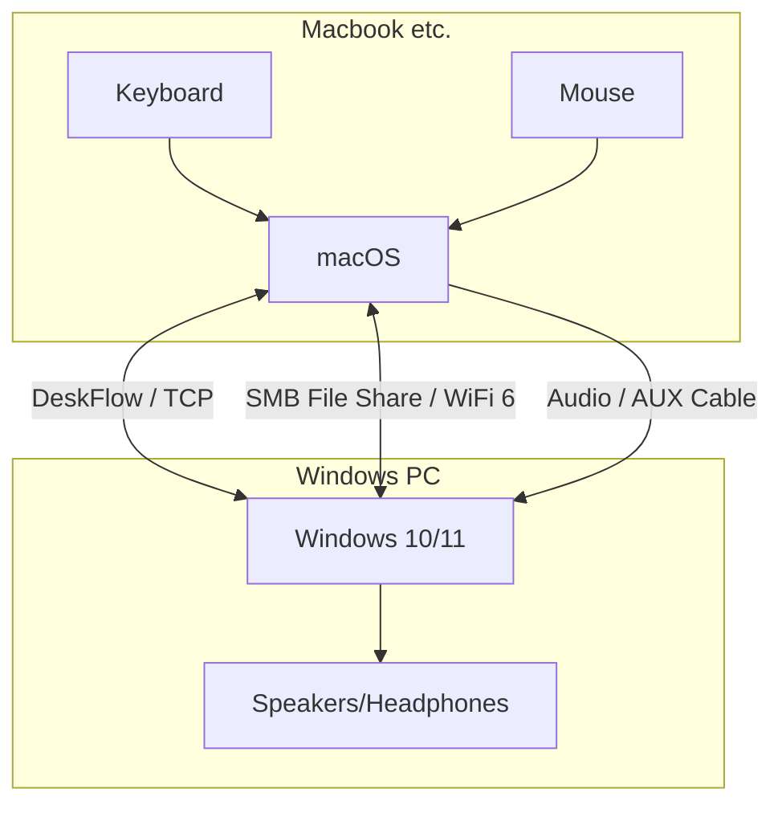

  <a href="./README.md">简体中文</a> | English

# 🌉 Win-Mac DeskBridge

  

> **No more cables. Build the ultimate seamless workflow between Windows and macOS using open-source tools.**

## 📖 Introduction

**Win-Mac DeskBridge** is not a single software, but a field-tested **LAN Interconnection Solution**.

Designed for users with a **"Mac (Primary) + Windows (Secondary)"** setup (or vice versa), we utilize open-source/native technologies like DeskFlow, SMB, and LocalSend to achieve a **zero-cost** hardware-like experience:

* 🖱️ **Unified Input**: One keyboard/mouse controls both screens. Clipboard syncs instantly.
* ⌨️ **Muscle Memory**: Map keys to use your preferred shortcuts (e.g., unified Ctrl/Command) on both ends.
* 📂 **High-Speed Transfer**: Maximize LAN bandwidth for file access, just like a local drive.
* 🔊 **Audio Bridge**: Play Mac audio directly through Windows speakers/headphones.

---

## 🚀 Features & Guides

Detailed configurations are split into independent modules. Click to read:

### 1. [🖱️ Input & Clipboard Flow](./docs/en/1-input-share.md)
Setup guide based on **DeskFlow** (Open-source fork of Synergy).
* **Value**: Free, open-source, supports macOS Sonoma/Sequoia.
* **Troubleshooting**: Fix macOS permission errors, `invalid character` config bugs, etc.

### 2. [⌨️ Key Mapping](./docs/en/2-key-mapping.md)
**The soul of this solution.** Never force yourself to adapt to a different layout.
* **Mapping**: Perfectly map Win `Ctrl` to Mac `Command` (or vice versa).
* **Fixes**: Solve F1-F12 system hijacking and Fn-lock issues.
* **Input Method**: Unify language switching shortcuts.

### 3. [📂 File Tunnel](./docs/en/3-file-share.md)
Two complementary strategies:
* **Heavy Duty (SMB)**: Mount Mac as a network drive (Z:) on Windows for direct large file access.
* **Ad-hoc (LocalSend)**: AirDrop-like tool for quick text/image transfer.

### 4. [🔊 Zero-Latency Audio Bridge](./docs/en/4-audio-share.md)
Make one machine "mute" and route all audio to the main speakers.
* **Hardware (Recommended)**: Use an AUX cable for true 0-latency.
* **Software**: Use Bluetooth A2DP Receiver or SonoBus (Low latency LAN audio).

### 5. [🧪 Automation Scripts (Beta)](./docs/en/5-automation.md)
One-click setup scripts for Shell (macOS) and PowerShell (Windows).
* Auto-install software, fix permissions, and generate config files.

---

## 🛠️ Architecture

---

## 🎓 Background

This project originated from the research environment at **[AGI-FBHC](https://github.com/AGI-FBHC)** Lab.

To bridge the gap between Deep Learning training (Windows/Linux) and Paper writing/Daily work (macOS), we standardized this best practice. It significantly improved our efficiency in switching between multiple devices.

If you are interested in our research, please visit our homepage: [https://github.com/AGI-FBHC](https://github.com/AGI-FBHC)

---

## 🔗 Credits

This solution integrates the following excellent open-source projects:

* **[DeskFlow](https://github.com/deskflow/deskflow)** - Cross-platform clipboard and mouse sharing (GPL-2.0).
* **[LocalSend](https://github.com/localsend/localsend)** - An open-source AirDrop alternative (MIT).
* **[SonoBus](https://github.com/sonosaurus/sonobus)** - High-quality network audio streaming (GPL-3.0).

## 📄 License

This project is licensed under the MIT License - see the [LICENSE](LICENSE) file for details.